# AWS Customer Management Portal - ClientLink

A secure, scalable customer management portal built on AWS infrastructure with high availability, fault tolerance, and SEO optimization through a static blog component.

## 🏗️ System Architecture

```mermaid
graph TB
    subgraph "Internet"
        Users[👥 Users]
        BlogUsers[📖 Blog Visitors]
    end
    
    subgraph "AWS Cloud"
        IGW[🌐 Internet Gateway]
        
        subgraph "VPC (10.0.0.0/16)"
            subgraph "Public Subnet (10.0.0.0/24)"
                ALB[⚖️ Application Load Balancer]
                NAT[🔄 NAT Gateway]
                EC2_Public[🖥️ EC2 Instance<br/>Apache + PHP]
            end
            
            subgraph "Private Subnet (10.0.1.0/24)"
                RDS[(🗄️ MySQL RDS<br/>client-db)]
                EC2_ASG[📊 Auto Scaling Group<br/>Min: 1, Max: 4]
            end
        end
        
        subgraph "S3"
            S3_Blog[📝 Static Blog<br/>Website Hosting]
        end
        
        subgraph "CloudWatch"
            CW_Alarms[📈 CPU Alarms<br/>Scaling Triggers]
        end
    end
    
    Users --> IGW
    IGW --> ALB
    ALB --> EC2_Public
    ALB --> EC2_ASG
    EC2_Public --> RDS
    EC2_ASG --> RDS
    NAT --> IGW
    EC2_ASG --> NAT
    
    BlogUsers --> S3_Blog
    CW_Alarms --> EC2_ASG
    
    classDef publicSubnet fill:#e1f5fe
    classDef privateSubnet fill:#f3e5f5
    classDef storage fill:#fff3e0
    classDef monitoring fill:#e8f5e8
    
    class ALB,NAT,EC2_Public publicSubnet
    class RDS,EC2_ASG privateSubnet
    class S3_Blog storage
    class CW_Alarms monitoring
```



## 🎯 Project Objectives

- **Data Confidentiality**: Secure database in private subnet with restricted access
- **Scalability**: Auto Scaling Group with CloudWatch monitoring
- **Fault Tolerance**: Multi-AZ deployment with health checks
- **SEO Optimization**: Static blog hosted on S3 for improved visibility

## 🛠️ Technology Stack

| Component | Technology | Purpose |
|-----------|------------|---------|
| **Compute** | EC2 (Amazon Linux) | Web application hosting |
| **Database** | RDS MySQL | Customer data storage |
| **Load Balancing** | Application Load Balancer | Traffic distribution |
| **Auto Scaling** | Auto Scaling Groups | Dynamic capacity management |
| **Storage** | S3 | Static website hosting |
| **Networking** | VPC, Subnets, NAT Gateway | Network isolation & security |
| **Security** | Security Groups, IAM | Access control |
| **Monitoring** | CloudWatch | Performance monitoring & alarms |

## 🏗️ Infrastructure Components

### Networking Architecture
```
VPC (10.0.0.0/16)
├── Public Subnet (10.0.0.0/24)
│   ├── Internet Gateway
│   ├── NAT Gateway
│   ├── Application Load Balancer
│   └── Web Server EC2 Instances
└── Private Subnet (10.0.1.0/24)
    ├── RDS MySQL Database
    └── Auto Scaling Group Instances
```

### Security Groups Configuration

#### Frontend Security Group
- **Inbound Rules:**
  - HTTP (80): 0.0.0.0/0
  - HTTPS (443): 0.0.0.0/0
  - SSH (22): Admin IP range

#### Backend Security Group  
- **Inbound Rules:**
  - MySQL (3306): Frontend Security Group only

## 🚀 Deployment Guide

### Prerequisites
- AWS CLI configured with appropriate permissions
- Access to lab resources: `lab-app-php7.zip` and `static-website-crn.zip`

### Step 1: Network Infrastructure
```bash
# Create VPC with CIDR 10.0.0.0/16
aws ec2 create-vpc --cidr-block 10.0.0.0/16

# Create public subnet (10.0.0.0/24)
aws ec2 create-subnet --vpc-id <vpc-id> --cidr-block 10.0.0.0/24

# Create private subnet (10.0.1.0/24)  
aws ec2 create-subnet --vpc-id <vpc-id> --cidr-block 10.0.1.0/24

# Create and attach Internet Gateway
aws ec2 create-internet-gateway
aws ec2 attach-internet-gateway --vpc-id <vpc-id> --internet-gateway-id <igw-id>
```

### Step 2: Security Configuration
```bash
# Create IAM role for EC2 with RDS access
aws iam create-role --role-name EC2-RDS-Role --assume-role-policy-document file://trust-policy.json
aws iam attach-role-policy --role-name EC2-RDS-Role --policy-arn arn:aws:iam::aws:policy/AmazonRDSFullAccess
```

### Step 3: Database Setup
```bash
# Create RDS subnet group
aws rds create-db-subnet-group --db-subnet-group-name private-subnet-group --db-subnet-group-description "Private subnet group" --subnet-ids subnet-xxx subnet-yyy

# Launch RDS MySQL instance
aws rds create-db-instance \
  --db-instance-identifier client-db \
  --db-instance-class db.t3.micro \
  --engine mysql \
  --master-username admin \
  --master-user-password <password> \
  --allocated-storage 20 \
  --vpc-security-group-ids <backend-sg-id> \
  --db-subnet-group-name private-subnet-group
```

### Step 4: Web Application Deployment

#### User Data Script
```bash
#!/bin/bash
yum update -y
yum install -y httpd php php-mysql unzip

# Download and setup web application
wget https://example.com/lab-app-php7.zip
unzip lab-app-php7.zip -d /var/www/html/

# Configure database connection
cat > /var/www/html/config.php << EOF
<?php
define('DB_HOST', '${RDS_ENDPOINT}');
define('DB_USER', 'admin');
define('DB_PASS', '${DB_PASSWORD}');
define('DB_NAME', 'labdb');
?>
EOF

# Start services
systemctl enable httpd
systemctl start httpd
```

### Step 5: Load Balancer and Auto Scaling
```bash
# Create launch template
aws ec2 create-launch-template \
  --launch-template-name customer-portal-template \
  --launch-template-data file://launch-template.json

# Create Auto Scaling Group
aws autoscaling create-auto-scaling-group \
  --auto-scaling-group-name customer-portal-asg \
  --launch-template LaunchTemplateName=customer-portal-template,Version=1 \
  --min-size 1 \
  --max-size 4 \
  --desired-capacity 2 \
  --vpc-zone-identifier "subnet-xxx,subnet-yyy"
```

### Step 6: Static Blog Setup
```bash
# Create S3 bucket for static hosting
aws s3 mb s3://clientlink-blog-static

# Enable static website hosting
aws s3 website s3://clientlink-blog-static --index-document index.html

# Upload blog files
aws s3 sync ./static-website-crn/ s3://clientlink-blog-static --acl public-read
```

## 📊 Monitoring and Scaling

### CloudWatch Alarms
- **CPU Utilization > 70%**: Scale Out (Add Instance)
- **CPU Utilization < 30%**: Scale In (Remove Instance)
- **Health Check Failures**: Instance Replacement

### Health Checks
- **ALB Health Check**: HTTP GET on `/health.php`
- **Auto Scaling Health Check**: EC2 instance status
- **RDS Monitoring**: Connection count, CPU utilization

## 🔐 Security Features

### Network Security
- **Private Subnet Isolation**: Database not directly accessible from internet
- **NAT Gateway**: Controlled outbound internet access for private resources
- **Security Group Rules**: Principle of least privilege

### Access Control
- **IAM Roles**: EC2 instances use roles instead of access keys
- **Database Security**: MySQL access restricted to application tier only
- **S3 Bucket Policy**: Public read access only for blog content

## 🧪 Testing and Validation

### Functional Testing
1. **Web Application Access**
   ```bash
   curl -I http://<alb-dns-name>
   ```

2. **Database Connectivity**
   ```bash
   mysql -h <rds-endpoint> -u admin -p labdb
   ```

3. **Static Blog Access**
   ```bash
   curl -I http://<s3-bucket>.s3-website-<region>.amazonaws.com
   ```

### Load Testing
```bash
# Using Apache Bench
ab -n 1000 -c 10 http://<alb-dns-name>/
```

## 📈 Performance Metrics

| Metric | Target | Monitoring |
|--------|--------|------------|
| Response Time | < 2 seconds | CloudWatch |
| Availability | 99.9% | ALB Health Checks |
| CPU Utilization | 30-70% | Auto Scaling Triggers |
| Database Connections | < 80% of max | RDS Monitoring |

## 🎯 Key Achievements

✅ **Secure Architecture**: Database isolated in private subnet  
✅ **High Availability**: Multi-AZ deployment with load balancing  
✅ **Auto Scaling**: Dynamic capacity based on demand  
✅ **Cost Optimization**: S3 static hosting for blog content  
✅ **Fault Tolerance**: Health checks and automatic recovery  
✅ **SEO Enhancement**: Static blog for improved search visibility

## 🔧 Configuration Files

### Launch Template Configuration
```json
{
  "ImageId": "ami-xxxxxxxxx",
  "InstanceType": "t3.micro",
  "IamInstanceProfile": {
    "Name": "EC2-RDS-Role"
  },
  "SecurityGroupIds": ["sg-frontend"],
  "UserData": "base64-encoded-user-data-script"
}
```

### S3 Bucket Policy
```json
{
  "Version": "2012-10-17",
  "Statement": [
    {
      "Sid": "PublicReadGetObject",
      "Effect": "Allow",
      "Principal": "*",
      "Action": "s3:GetObject",
      "Resource": "arn:aws:s3:::clientlink-blog-static/*"
    }
  ]
}
```

## 🚧 Future Enhancements

- [ ] **CDN Integration**: CloudFront for improved global performance
- [ ] **SSL/TLS**: ACM certificates for HTTPS encryption
- [ ] **Database Backups**: Automated RDS snapshots and point-in-time recovery
- [ ] **Logging**: Centralized logging with CloudWatch Logs
- [ ] **CI/CD Pipeline**: Automated deployment with CodePipeline
- [ ] **Multi-Region**: Cross-region replication for disaster recovery

## 🏷️ Tags and Labels

- **Environment**: Production
- **Project**: CustomerPortal
- **Owner**: ClientLink
- **Cost Center**: IT-Infrastructure
- **Backup**: Required

## 📞 Support and Maintenance

For issues and maintenance:
- Monitor CloudWatch dashboards
- Check ALB access logs
- Review RDS performance insights
- Validate S3 blog accessibility

---

## 🤝 Contributing

1. Fork the repository
2. Create a feature branch (`git checkout -b feature/improvement`)
3. Commit your changes (`git commit -am 'Add improvement'`)
4. Push to the branch (`git push origin feature/improvement`)
5. Create a Pull Request

## 📄 License

This project is licensed under the MIT License - see the [LICENSE](LICENSE) file for details.

---

**Built with ❤️ using AWS Cloud Infrastructure**
